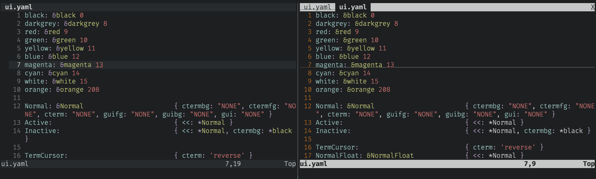
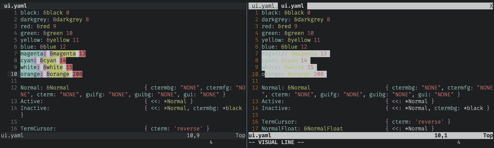

# walh

yes walh does mean what you think it does

**walh** = "winnebago audi lamborghini hatchback"

A vim theme repo that is easy on the eyes and for long hours looking at a
screen. All colors are used from the ANSI colors of the terminal in use. A color
scheme for vim.

- Options for light and dark mode based on terminal settings.

## screenshots walh vs default

- walh on the left, default on the right
- using alacritty-shell (tomorrow, and tomorrow-dark themes)

### light terminal colors


### dark terminal colors



### visual mode



Supported plugins highlights:

- [NeoVim bulit-in LSP](https://neovim.io/doc/user/lsp.html)
- [ale](https://github.com/dense-analysis/ale)
- [coc.nvim](https://github.com/neoclide/coc.nvim)
- [nvim-cmp](https://github.com/hrsh7th/nvim-cmp)

## Designed to be run with x-shell

- [alacritty-shell](https://github.com/casonadams/alacritty-shell)
- [walh-shell](https://github.com/casonadams/walh-shell)

these are similar to `base16-shell` and add additional index colors.

walh uses `colour208` as `orange`

So it might not look correct unless those colors are set accordingly.

### additional plugins to make it smooth

**NOTE** use one or the other for more syntax highlight support

- `sheerun/vim-polyglot`
- `nvim-treesitter/nvim-treesitter`

## Install

### Add plugin

- `casonadams/walh`

### Set and configure theme

| Themes              |
| ------------------- |
| walh-blue           |
| walh-darcula        |
| walh-default        |
| walh-default-legacy |
| walh-gruvbox        |
| walh-nord           |
| walh-one            |
| walh-solarized      |

```init.vim
set notermguicolors
colorscheme walh-default
```

## Pane Dimming neovim

```sh
vim.g.walh_dimming = 1
```

## Tmux Dimming

Add the following to `~/.tmux.conf` for dimming that matches `walh`

```conf
set -g pane-active-border-style bg=color0
set -g pane-border-style bg=color0
set-window-option -g window-active-style bg=terminal
set-window-option -g window-style bg=color0
```

## extending with neovim

[nvim_set_hl()](https://neovim.io/doc/user/api.html#nvim_set_hl())

This command creates a highlight group caled `PanelHeading`

```lua
local c = {
  black = 0,
  darkgrey = 8,
  red = 9,
  green = 10,
  yellow = 11,
  blue = 12,
  magenta = 13,
  cyan = 14,
  white = 15,
  none = "NONE",
}

vim.api.nvim_set_hl(
    0, "PanelHeading",
    { ctermfg = c.black, ctermbg = c.blue, bold = true }
)
```

## bufferline.nvim

[bufferline.nvim](https://github.com/akinsho/bufferline.nvim)
<details>
<summary>Bufferline example</summary>
<p>

```lua
local c = {
  black = 0,
  darkgrey = 8,
  red = 9,
  green = 10,
  yellow = 11,
  blue = 12,
  magenta = 13,
  cyan = 14,
  white = 15,
  none = "NONE",
}

local bufferline = require("bufferline")
bufferline.setup({
  highlights = {
    fill = {
      ctermfg = c.none,
      ctermbg = c.black,
    },
    background = {
      ctermfg = c.darkgrey,
      ctermbg = c.black,
    },
    tab = {
      ctermfg = c.darkgrey,
      ctermbg = c.black,
    },
    tab_selected = {
      ctermfg = c.none,
      ctermbg = c.black,
    },
    tab_close = {
      ctermfg = c.none,
      ctermbg = c.black,
    },
    tab_separator = {
      ctermfg = c.darkgrey,
      ctermbg = c.black,
    },
    tab_separator_selected = {
      ctermfg = c.none,
      ctermbg = c.black,
    },
    close_button = {
      ctermfg = c.darkgrey,
      ctermbg = c.black,
    },
    close_button_visible = {
      ctermfg = c.darkgrey,
      ctermbg = c.black,
    },
    close_button_selected = {
      ctermfg = c.none,
      ctermbg = c.black,
    },
    buffer_visible = {
      ctermfg = c.darkgrey,
      ctermbg = c.black,
    },
    buffer_selected = {
      ctermfg = c.none,
      ctermbg = c.black,
    },
    numbers = {
      ctermfg = c.none,
      ctermbg = c.black,
    },
    numbers_visible = {
      ctermfg = c.none,
      ctermbg = c.black,
    },
    numbers_selected = {
      ctermfg = c.none,
      ctermbg = c.black,
    },
    diagnostic = {
      ctermfg = c.none,
      ctermbg = c.black,
    },
    diagnostic_visible = {
      ctermfg = c.none,
      ctermbg = c.black,
    },
    diagnostic_selected = {
      ctermfg = c.none,
      ctermbg = c.black,
    },
    hint = {
      ctermfg = c.none,
      ctermbg = c.black,
    },
    hint_visible = {
      ctermfg = c.none,
      ctermbg = c.black,
    },
    hint_selected = {
      ctermfg = c.none,
      ctermbg = c.black,
    },
    hint_diagnostic = {
      ctermfg = c.none,
      ctermbg = c.black,
    },
    hint_diagnostic_visible = {
      ctermfg = c.none,
      ctermbg = c.black,
    },
    hint_diagnostic_selected = {
      ctermfg = c.none,
      ctermbg = c.black,
    },
    info = {
      ctermfg = c.none,
      ctermbg = c.black,
    },
    info_visible = {
      ctermfg = c.none,
      ctermbg = c.black,
    },
    info_selected = {
      ctermfg = c.none,
      ctermbg = c.black,
    },
    info_diagnostic = {
      ctermfg = c.none,
      ctermbg = c.black,
    },
    info_diagnostic_visible = {
      ctermfg = c.none,
      ctermbg = c.black,
    },
    info_diagnostic_selected = {
      ctermfg = c.none,
      ctermbg = c.black,
    },
    warning = {
      ctermfg = c.none,
      ctermbg = c.black,
    },
    warning_visible = {
      ctermfg = c.none,
      ctermbg = c.black,
    },
    warning_selected = {
      ctermfg = c.none,
      ctermbg = c.black,
    },
    warning_diagnostic = {
      ctermfg = c.none,
      ctermbg = c.black,
    },
    warning_diagnostic_visible = {
      ctermfg = c.none,
      ctermbg = c.black,
    },
    warning_diagnostic_selected = {
      ctermfg = c.none,
      ctermbg = c.black,
    },
    error = {
      ctermfg = c.none,
      ctermbg = c.black,
    },
    error_visible = {
      ctermfg = c.none,
      ctermbg = c.black,
    },
    error_selected = {
      ctermfg = c.none,
      ctermbg = c.black,
    },
    error_diagnostic = {
      ctermfg = c.none,
      ctermbg = c.black,
    },
    error_diagnostic_visible = {
      ctermfg = c.none,
      ctermbg = c.black,
    },
    error_diagnostic_selected = {
      ctermfg = c.none,
      ctermbg = c.black,
    },
    modified = {
      ctermfg = c.none,
      ctermbg = c.black,
    },
    modified_visible = {
      ctermfg = c.yellow,
      ctermbg = c.black,
    },
    modified_selected = {
      ctermfg = c.yellow,
      ctermbg = c.black,
    },
    duplicate_selected = {
      ctermfg = c.none,
      ctermbg = c.black,
    },
    duplicate_visible = {
      ctermfg = c.none,
      ctermbg = c.black,
    },
    duplicate = {
      ctermfg = c.none,
      ctermbg = c.black,
    },
    separator_selected = {
      ctermfg = c.none,
      ctermbg = c.black,
    },
    separator_visible = {
      ctermfg = c.none,
      ctermbg = c.black,
    },
    separator = {
      ctermfg = c.none,
      ctermbg = c.black,
    },
    indicator_selected = {
      ctermfg = c.none,
      ctermbg = c.black,
    },
    indicator_visible = {
      ctermfg = c.none,
      ctermbg = c.black,
    },
    pick_selected = {
      ctermfg = c.none,
      ctermbg = c.black,
    },
    pick_visible = {
      ctermfg = c.none,
      ctermbg = c.black,
    },
    pick = {
      ctermfg = c.none,
      ctermbg = c.black,
    },
    offset_separator = {
      ctermfg = c.darkgrey,
      ctermbg = c.black,
    },
  },
})
```

</p>
</details>
